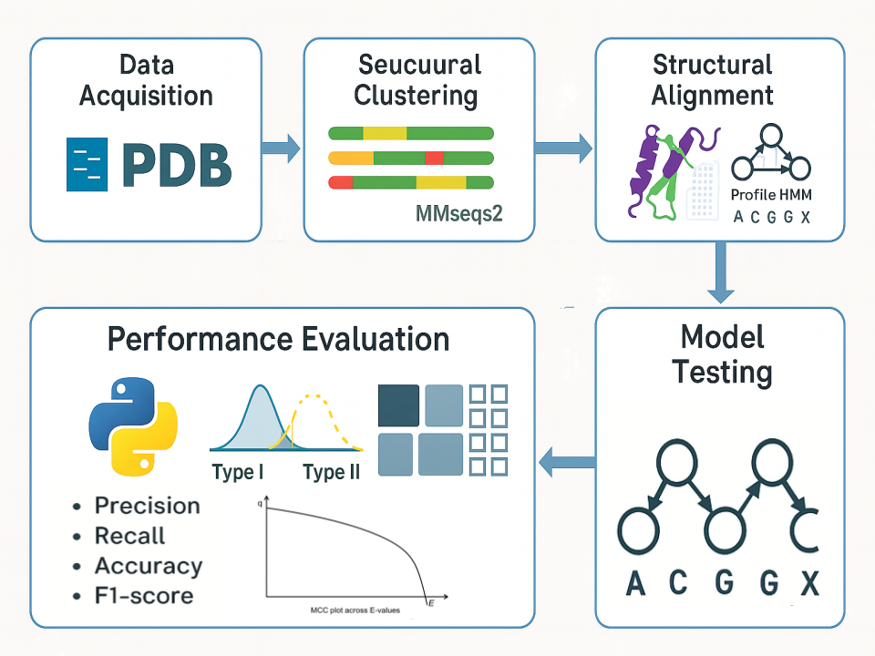

<div align="center">

# Kunitz Domain HMM Classification Project

  

[](https://github.com/)
[](LICENSE)
[](https://github.com/)
[](http://hmmer.org/)
[](https://www.python.org/)

</div>

This repository contains the complete pipeline and materials for building, evaluating, and validating a profile HMM designed to detect Kunitz-type domains in protein sequences, as part of the final assessment for **Laboratory of Bioinformatics 1 @ University of Bologna**.

---

## Project Overview

This project addresses the identification of **Kunitz-type serine protease inhibitors** through a **custom-trained HMM**, evaluated for performance on diverse validation datasets. The model was built from structure-based alignments, evaluated using strict quality metrics, and benchmarked against known positive and negative datasets.

---

## 🗂️ Repository Structure

```bash
├── data/                         # All datasets (.fasta, .class)
├── alignments/                  # Cleaned PDBeFold alignments
├── results/                     # Evaluation output (heatmaps, matrices)
├── scripts/                     # Bash and Python scripts for processing
├── figures/                     # Structural comparison figures
├── docs/                        # Manuscript or report drafts
├── README.md
```
## Project Workflow Summary

### 1. Data Acquisition and Preprocessing

- Data was retrieved from RCSB PDB using a custom query:
  - Pfam ID: PF00014
  - Resolution ≤ 3 Å
  - Sequence length between 45–80 residues
- A custom report was downloaded from the RCSB website including the following fields:
  - Entry ID
  - Polymer Entity ID
  - Sequence
  - Annotation Identifier
  - Chain ID

- Extracted FASTA sequences from the CSV report using `scripts/01_csv_to_fasta.sh`


### 2. Sequence Clustering

- Clustered with MMseqs2 using `scripts/02_mmseqs_cluster.sh`
- Identity threshold: 90%, coverage: 80%
- Output: representative sequences for further analysis

### 3. ID Extraction for Structural Search

- Used `scripts/03_extract_ids.sh` to format IDs for PDBeFold

### 4. Structural Filtering

- Extracted desired chains from downloaded PDB files using:
  ```
  ./scripts/04_extract_chains.sh <cleaned_id_list> <raw_pdb_dir> <output_dir>
  ```
- Manual QC in AliView and ChimeraX identified and excluded:
  - `1yld_B` (truncated structure)
  - `5jbt_Y` (structurally divergent)

### 5. Structural Alignment and Quality Assessment

- Ran all-vs-all TM-align using `scripts/05_run_tmalign.sh`
- Parsed and visualized results using `scripts/06_parse_tmalign.py`
  - Outputs: RMSD and TM-score matrices, rankings, heatmaps
  - Top reference: `1f5r_I`

### 6. Superposition

- Structures were aligned in ChimeraX using Matchmaker
- Alignment centered on `1f5r:I`
- Outputs include `.cxs` session file and figure

### 7: HMM Construction
```bash
hmmbuild kunitz_model.hmm pdb_kunitz_PDBeFold_alignment_clean.fasta.ali
```
### 8: HMM Evaluation
Validation datasets used:

- human_kunitz.fasta
- human_notkunitz.fasta
- nothuman_kunitz.fasta
- uniprot_sprot.fasta (background)

These datasets were classified using hmmsearch, and the results were parsed to compute performance metrics via a custom Python script performance.py.

## 📈 Performance Results
| UniProt ID | Length | \# Domains (PF00014) | Domain Position(s) | Comments               |
|------------|--------|----------------------|--------------------|------------------------|
| A0A1Q1NL17 | 101    | 1                    | 32--88             | Short sequence         |
| O62247     | 202    | 1                    | 138--184           | Domain near C-terminal |
| Q8WPG5     | 134    | 2                    | 17--69, 83--129    | Tandem domains         |
| D3GGZ8     | 195    | 1                    | 120--190           | Domain near C-terminal |

> Best result observed with E-value threshold = 1e-06 using full sequence mode:
MCC = 0.9945, TPR = 1.0, PPV = 0.989
